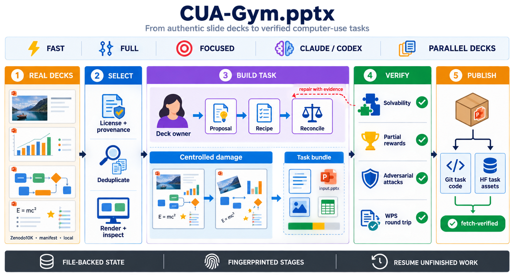

# pptxgym

[](https://pypi.org/project/pptxgym/)
[](https://pypi.org/project/pptxgym/)
[](https://github.com/Lyt060814/CUA-Gym.pptx/actions/workflows/ci.yml)

`pptxgym` turns real PowerPoint decks into validated computer-use tasks. It
selects suitable decks, proposes repair tasks, applies controlled damage,
builds partial-reward evaluators, runs solvability and attack gates, and can
publish the resulting task code and assets.

The default workflow runs on a Linux server. Hugging Face Jobs is an optional
executor, not a requirement.

## System Overview



Each deck has one owner, while Python owns state, deterministic transformations,
reward construction, quality gates, and publication. Failed gates return
evidence for repair; only mechanically shipped decks enter the task registry.

## Modes

| Mode | Model structure | Use it for |
| --- | --- | --- |
| `fast` | One owner writes proposal, recipe, and reconciliation; an independent sealed probe remains | Normal scaling |
| `full` | Independent specialists write proposal, recipe, reconciliation, and solvability evidence | Maximum review independence |
| `focused` | Fast structure plus balanced selection and hard recipe constraints for animation, equation, native chart, and effects tasks | Filling capability gaps |

`focused` is not a more expensive version of `full`. It is close to `fast` in
model usage, but only accepts tasks in its assigned native feature family.

The model CLI is configured separately as a **harness**: `claude` or `codex`.
Each pipeline stage can use a different model, effort, endpoint, and credential.

## Agent Quick Start

Most coding agents read the repository's [`AGENTS.md`](AGENTS.md) automatically;
`CLAUDE.md` forwards Claude Code to the same contract. The repository also
ships a `pptxgym-operator` skill for setup, run, resume, and publish interviews
under `.agents/skills/`, mirrored under `.claude/skills/`. Open this checkout
in an agent and send:

```text
Read AGENTS.md in full and help me set up pptxgym. Inspect the host and any
existing config first, then ask me only the missing decisions in small groups.
Do not ask me to paste secrets into chat. Show me the effective setup before
changing anything, run doctor after setup, and do not launch or publish until
I explicitly confirm it.
```

For a batch, ask the agent to inspect the existing setup and then collect deck
count, mode, worker limits, executor, monitoring, and publish choices before it
launches. Copyable prompts for setup, running, resume, and publish are in
[Agent Quick Start](docs/agent-quickstart.md).

## Manual Quick Start

Requirements: Linux, Python 3.10+, LibreOffice, Poppler, and either the Claude
Code or Codex CLI. WPS is optional; without it the round-trip gap is recorded.

Install the released package. The `corpus` extra is required for the default
Zenodo10K source:

```bash
curl -LsSf https://astral.sh/uv/install.sh | sh
uv tool install 'pptxgym[corpus]'
pptxgym --help
```

`pip install 'pptxgym[corpus]'` is also supported inside a virtual
environment. On a bare Ubuntu host, clone the repository and review
`image/bootstrap.sh` before running it as root. It installs system packages,
WPS Office, Node, Claude Code, and Codex.

Authenticate the harness once on the host:

```bash
claude auth login # Claude harness
# or
codex login      # Codex harness
```

Create a local-first configuration and check it:

```bash
pptxgym setup --harness claude
pptxgym doctor
pptxgym harness list
```

Run ten decks. Publishing is disabled unless configured and requested.

```bash
pptxgym run --mode fast --count 10 --detach
pptxgym run-status runs/fast-<timestamp>
pptxgym logs runs/fast-<timestamp> --follow
```

Every run freezes its resolved settings in `run.toml`. Resume uses that
snapshot and the existing stage fingerprints; it does not start completed
decks from scratch.

```bash
pptxgym resume runs/fast-<timestamp> --detach
pptxgym verify runs/fast-<timestamp>
```

For development from a source checkout instead, use
`uv sync --extra dev --extra corpus` and prefix commands with `uv run`.

## Configuration

The default file is `~/.config/pptxgym/config.toml`. Credentials live in a
separate mode-`0600` `credentials.toml`; API key values are never copied into
the public config or a run snapshot.

Important sections:

- `execution`: local or `hf-jobs`, work root, timeout, WPS policy.
- `concurrency`: deck, probe, CPU, and selection worker pools.
- `source`: Zenodo10K, a pinned manifest, or a local directory.
- `harnesses` and `connections`: Claude/Codex CLIs and native/relay endpoints.
- `routes`: owner, proposal, recipe, reconcile, and probe model assignments.
- `storage`: local run state or a Hugging Face results dataset.
- `publish`: rollout checkout/repository, asset dataset, ID series, and lists.

`auto` concurrency is deliberately conservative: it uses the selected
harness's `max_concurrency` and never exceeds the deck count. Set a number for
a measured limit or `all` to match the deck count explicitly.

See [configuration](docs/configuration.md) and the files under [`configs/`](configs/).

An installed wheel also carries the agent contract and operator workflow:

```bash
pptxgym guide agent
pptxgym guide operator
```

## Sources

The default source is the license-filtered Zenodo10K flow and requires the
`corpus` extra. Selection produces a
pinned manifest and joins provenance by filename, not deck order.

For a local directory:

```bash
pptxgym setup --force --harness codex \
  --source-type local --source-path /data/decks
pptxgym run --mode fast --count 20
```

Publishing local decks additionally requires a JSON provenance manifest. This
is a hard gate because task assets are redistributed. See
[source configuration](docs/configuration.md#sources-and-licensing).

## Publishing

Publishing is opt-in and requires both a rollout target and an asset dataset.
It allocates IDs through a registry, verifies uploaded bytes are fetchable,
updates every configured task list, and commits the task files. A failed
publish can be retried without model calls:

New asset datasets default to private; public visibility must be configured
explicitly.

```bash
pptxgym publish runs/fast-<timestamp>
pptxgym verify runs/fast-<timestamp>
```

Only one publisher should update a registry at a time. Git pushes rebase and
retry when another contributor moves the shared branch, but concurrent ID
allocation against the same registry is intentionally unsupported.

## Hugging Face Jobs

Set `execution.executor = "hf-jobs"`, configure a writable results dataset and
the source repository/revision, then use the same `run`, `resume`, `logs`, and
`publish` commands. The launcher installs the runtime, checkpoints alternating
archives, restores the newest valid archive, and records the submitted job ID.

See [HF Jobs](docs/hf-jobs.md).

## More

- [Getting started](docs/getting-started.md)
- [Agent quick start](docs/agent-quickstart.md)
- [Configuration reference](docs/configuration.md)
- [Running, recovery, and publishing](docs/operations.md)
- [Architecture](docs/architecture.md)
- [Reward design](docs/design/reward.md)
- [Tool and operator reference](docs/reference/operators.md)
- [Validation evidence](docs/validation/)
- [Project backlog](docs/project/backlog.md)
- [Historical investigations](docs/history/)

Individual stage commands such as `ingest`, `propose`, `recipe`, and `harden`
remain available for debugging and targeted recovery. Most users should start
with the managed commands above.

## License

The source repository and PyPI package are publicly accessible, but the
software is **not open source**. It is distributed under the proprietary terms
in [LICENSE](LICENSE); public visibility does not grant permission to use,
copy, modify, or redistribute it.
